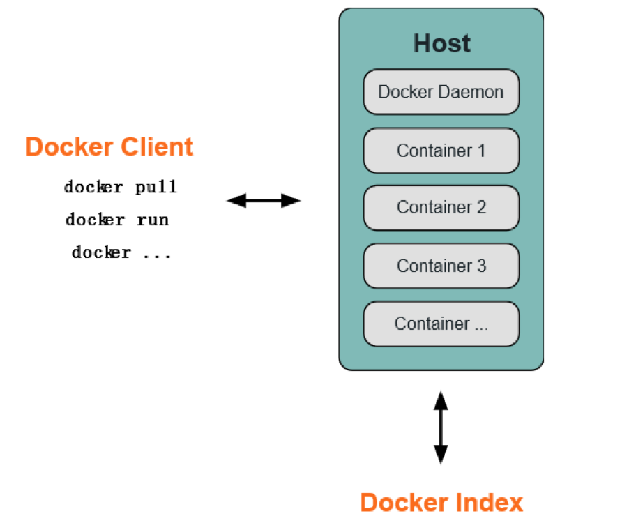
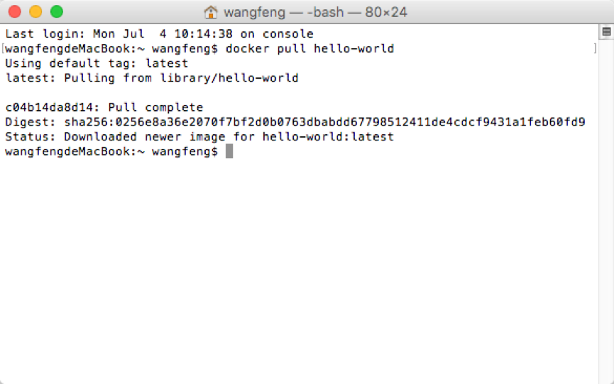
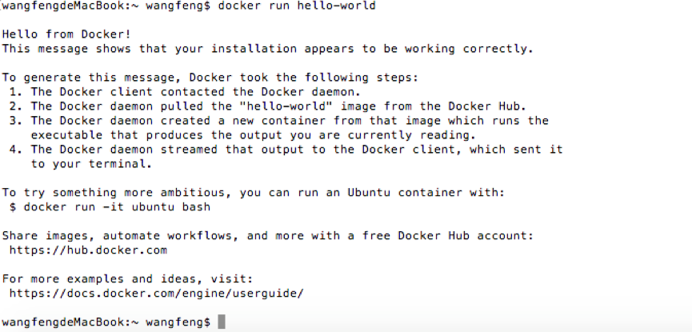
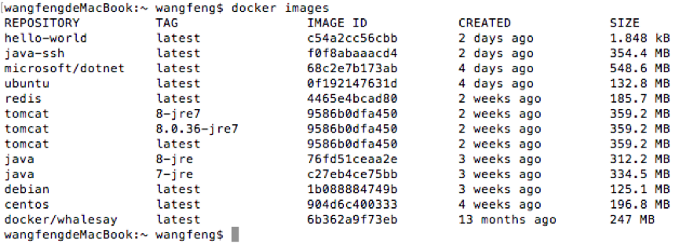
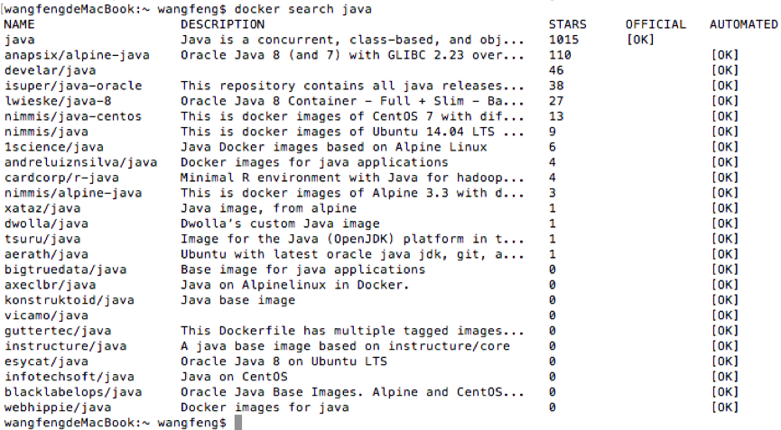
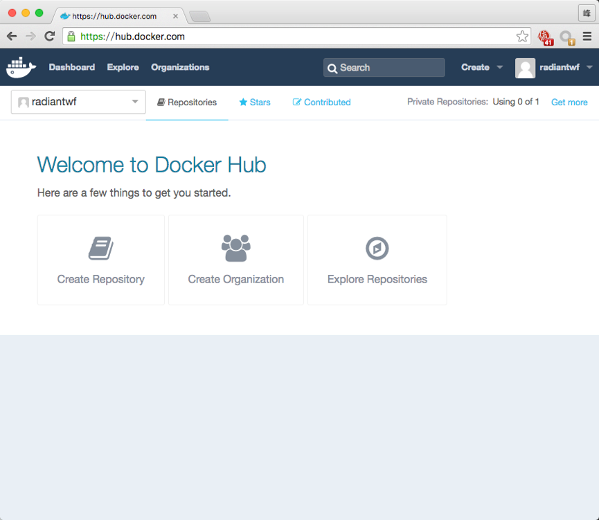
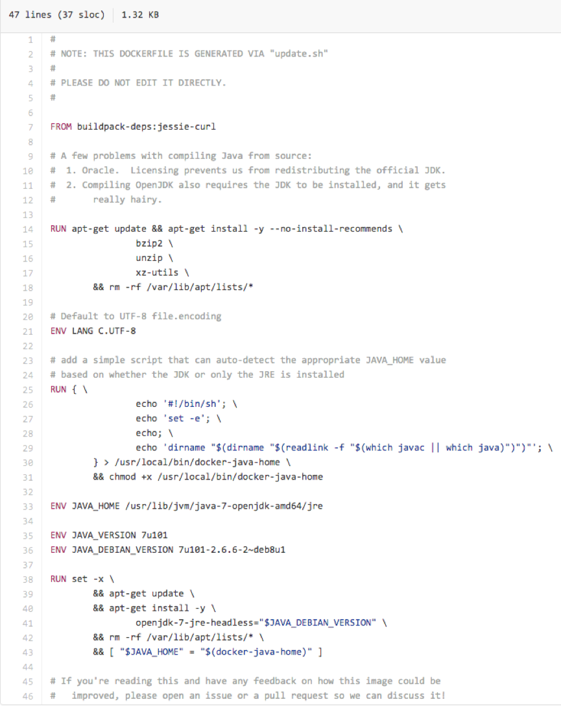

# Docker
## 一、	Docker 简介
Docker 使用客户端-服务器 (C/S) 架构模式。Docker 客户端会与 Docker 守护进程进行通信。Docker 守护进程会处理复杂繁重的任务，例如建立、运行、发布你的 Docker 容器。Docker 客户端和守护进程可以运行在同一个系统上，当然你也可以使用 Docker 客户端去连接一个远程的 Docker 守护进程。Docker 客户端和守护进程之间通过 socket 或者 RESTful API 进行通信。
 

 
### 1.1 Docker 守护进程
如上图所示，Docker 守护进程运行在一台主机上。用户并不直接和守护进程进行交互，而是通过 Docker 客户端间接和其通信。

### 1.2 Docker 客户端
Docker 客户端，实际上是 docker 的二进制程序，是主要的用户与 Docker 交互方式。它接收用户指令并且与背后的 Docker 守护进程通信，如此来回往复。

### 1.3 Docker 内部
要理解 Docker 内部构建，需要理解以下三种部件：
 
Docker 镜像 - Docker images
 
Docker 仓库 - Docker registeries
 
Docker 容器 - Docker containers
 
#### Docker 镜像
Docker 镜像是 Docker 容器运行时的只读模板，每一个镜像由一系列的层 (layers) 组成。Docker 使用 UnionFS 来将这些层联合到单独的镜像中。UnionFS 允许独立文件系统中的文件和文件夹(称之为分支)被透明覆盖，形成一个单独连贯的文件系统。正因为有了这些层的存在，Docker 是如此的轻量。当你改变了一个 Docker 镜像，比如升级到某个程序到新的版本，一个新的层会被创建。因此，不用替换整个原先的镜像或者重新建立(在使用虚拟机的时候你可能会这么做)，只是一个新 的层被添加或升级了。现在你不用重新发布整个镜像，只需要升级，层使得分发 Docker 镜像变得简单和快速。
#### Docker 仓库
Docker 仓库用来保存镜像，可以理解为代码控制中的代码仓库。同样的，Docker 仓库也有公有和私有的概念。公有的 Docker 仓库名字是 Docker Hub。Docker Hub 提供了庞大的镜像集合供使用。这些镜像可以是自己创建，或者在别人的镜像基础上创建。Docker 仓库是 Docker 的分发部分。
#### Docker 容器
Docker 容器和文件夹很类似，一个Docker容器包含了所有的某个应用运行所需要的环境。每一个 Docker 容器都是从 Docker 镜像创建的。Docker 容器可以运行、开始、停止、移动和删除。每一个 Docker 容器都是独立和安全的应用平台，Docker 容器是 Docker 的运行部分。
## 二、	Docker安装
请参照[官方文档](https://docs.docker.com/engine/installation/)。
 
Windows、Mac OS下载安装包，安装即可。

## 三、	Docker Images
### 3.1 下载Docker Image
docker pull命令
 
例：`docker pull hello-world`
 

 
docker run命令（启动容器命令）
 
例：`docker run hello-world`
 
若本地不存在要启动的Image，则线连接服务器下载Image
 
 
 
### 3.2 查看本地Docker Image
docker images 命令
 
例：`docker images`
 

 
### 3.3 Image简介
Repository： 可以理解为Image的名称。
 
Tag：Image的标签，一般用来标识版本，latest表示最新版。
 
Image ID：Image的Guid。

### 3.4 Image搜索
docker search 命令
 
例：`docker search java`
 
说明：检索所有包含java关键字的Image
 

 
Tag检索：命令行方式未找到方法，可以通过Docker Hub检索。

### 3.5 删除本地Image
docker rmi 命令
 
例：`docker rmi c54a2cc56cbb`
 
说明：删除Image ID为c54a2cc56cbb的本地Image
 
 
小技巧：删除所有本地Image
 
`docker rmi $(docker images -q -a)`
 
注：需要先关闭并删除所有容器
 
删除所有容器和本地所有Image
 
`docker kill $(docker ps -q) ; docker rm $(docker ps -a -q) ; docker rmi $(docker images -q -a) `

## 四、	Docker Hub
### 4.1 访问方式
URL：https://hub.docker.com/
 
浏览器打开上述网址即可，需要注册。
 

 
### 4.2 Image搜索
搜索Java，结果如下：
 

 
### 4.3 Image详细信息
点击第一个搜索结果后边的Details按钮，可以查看这个Image的详细信息。
 

 
页面中的文字信息，包含该项目的描述信息。一般官方Image的信息比较全，比如Java的包含详细的版本信息，对应不同Tag的Docerfile的链接，以及如何使用这个Image。
 
通过页面中的事例可以build一个包含应用和jre7的镜像（Image），并且在一个容器中启动这个镜像的应用。
 
Dockerfile的语法，以及如何build一个Image将在后边介绍。
 
点击Tags标签，可以查询这个Image的相关Tags的信息。

### 4.4 Image下载
在Docker Hub上检索到的项目，可以通过docker pull命令进行下载。
 
请参照上述docker pull命令的介绍。

### 4.5 Image发布
可以通过docker push命令把自己制作的Image发布到Docker Hub上（没有实际操作过），具体语法，可以参照后边的语法介绍。

### 4.6 私有Docker Hub搭建
本文档后边有相关介绍。

## 五、	Docker containers
### 5.1 创建并启动container
docker run命令
 
例： `docker run hello-world`

### 5.2 查看container
docker ps命令
 
例：`docker ps / docker ps –a`
 
说明：包含-a参数是指查询所有容器，包含已经退出的。没有-a参数的只显示正在运行的容器。

### 5.3 其他container操作
docker stop/start命令	停止、启动容器
 
`docker rm`						删除容器
 
`docker top`					显示容器内的进程
 
`docker commit`					提交容器保存成新的镜像
 
上述操作的具体语法，请参照docker语法说明

### 5.4 与container交互
`docker run –i`
 
`docker start –i`
 
`docker cp`
 
上述操作的具体语法，请参照docker语法说明

## 六、	创建Docker Image
这次调研发现可以使用两种方法创建Docker Image。
 
方法一：使用docker build命令通过Dockerfile创建Docker Image；
 
方法二：使用docker commit命令提交已经存在的容器创建Docker Image。

### Dockerfle语法简介
指令的一般格式为 INSTRUCTION arguments ，指令包括 FROM 、 MAINTAINER 、RUN 等。
 
#### FROM
格式为 `FROM <image> 或 FROM <image:<tag>> `
 
第一条指令必须为 FROM 指令。并且，如果在同一个Dockerfile中创建多个镜像时，可以使用多个 FROM 指令（每个镜像一次）。
 
#### MAINTAINER
格式为`MAINTAINER <name>` ，指定维护者信息
 
#### RUN
格式为 `RUN <command>` 或 `RUN ["executable", "param1", "param2"]` 。
 
前者将在shell终端中运行命令，即 /bin/sh -c ；后者则使用 exec 执行。指定使用其它终端可以通过第二种方式实现。
 
例如 `RUN ["/bin/bash", "-c", "echo hello"]` 
 
每条 RUN 指令将在当前镜像基础上执行指定命令，并提交为新的镜像。当命令较长时可以使用 \ 来换行。
 
#### CMD
支持三种格式
 
•	`CMD ["executable","param1","param2"]` 使用 exec 执行，推荐方式；
 
•	`CMD command param1 param2` 在 /bin/sh 中执行，提供给需要交互的应用；
 
•	`CMD ["param1","param2"]` 提供给 ENTRYPOINT 的默认参数；
 
指定启动容器时执行的命令，每个Dockerfile只能有一条 CMD 命令。如果指定了多条命令，只有最后一条会被执行。
 
如果用户启动容器时候指定了运行的命令，则会覆盖掉 CMD 指定的命令。
 
#### EXPOSE
格式为 `EXPOSE <port> [<port>...] `
 
告诉Docker服务端容器暴露的端口号，供互联系统使用。

#### ENV
格式为 `ENV <key <value> >`

指定一个环境变量，会被后续 RUN 指令使用，并在容器运行时保持。
 
例如  

    ENV PG_MAJOR 9.3
    ENV PG_VERSION 9.3.4
    RUN curl -SL http://example.com/postgres-$PG_VERSION.tar.xz | tar -xJC /usr/src/postgress && …
    ENV PATH /usr/local/postgres-$PG_MAJOR/bin:$PATH
 
#### ADD
格式为 `ADD <src <dest> >`
 
该命令将复制指定的 <src 到容器中的 <dest> 。 其中 <src> 可以是Dockerfile所在目录的一个相对路径；也可以是一个URL；还可以是一个tar文件（自动解压为目录）。
 
#### COPY
格式为 `COPY <src <dest> >`
 
复制本地主机的 <src （为Dockerfile所在目录的相对路径）到容器中的 <dest> 。
 
当使用本地目录为源目录时，推荐使用 COPY 。
 
#### ENTRYPOINT
两种格式：
 
•	`ENTRYPOINT ["executable", "param1", "param2"]`
 
•	`ENTRYPOINT command param1 param2` （shell中执行）。
 
配置容器启动后执行的命令，并且不可被 docker run 提供的参数覆盖。
 
每个Dockerfile中只能有一个 ENTRYPOINT ，当指定多个时，只有最后一个起效。
#### VOLUME
格式为 `VOLUME ["/data"]`
 
创建一个可以从本地主机或其他容器挂载的挂载点，一般用来存放数据库和需要保持的数据等。
 
#### USER
格式为 `USER daemon`
 
指定运行容器时的用户名或UID，后续的 RUN 也会使用指定用户。
 
当服务不需要管理员权限时，可以通过该命令指定运行用户。并且可以在之前创建所需要的用户。
 
例如： `RUN groupadd -r postgres && useradd -r -g postgres postgres` 。
要临时获取管理员权限可以使用 gosu ，而不推荐 sudo 。
 
#### WORKDIR
格式为 `WORKDIR /path/to/workdir`
 
为后续的 RUN 、 CMD 、 ENTRYPOINT 指令配置工作目录。
 
可以使用多个 WORKDIR 指令，后续命令如果参数是相对路径，则会基于之前命令指定的路径。例如：
 
    WORKDIR /a
    WORKDIR b
    WORKDIR c
    RUN pwd
 
则最终路径为 /a/b/c 。
 
#### ONBUILD
格式为 `ONBUILD [INSTRUCTION]`
 
配置当所创建的镜像作为其它新创建镜像的基础镜像时，所执行的操作指令。
 
例如，Dockerfile使用如下的内容创建了镜像 image-A 。
 
    [...]
    ONBUILD ADD . /app/src
    ONBUILD RUN /usr/local/bin/python-build --dir /app/src
    [...]
     
如果基于A创建新的镜像时，新的Dockerfile中使用 FROM image-A 指定基础镜像时，会自动执行 ONBUILD 指令内容，等价于在后面添加了两条指令。
 
    FROM image-A
 
    #Automatically run the following
    ADD . /app/src
    RUN /usr/local/bin/python-build --dir /app/src
     
使用 ONBUILD 指令的镜像，推荐在标签中注明，例如 ruby:1.9-onbuild 。
   
下面为java:7-jre的Dockerfile内容：
 

 
根据dockerfile文件的语法介绍，可以轻松理解上述内容。

## 七、	Docker私有库
Docker 官方提供了 docker registry 的构建方法 docker-registry
 
快速构建
 
快速构建 docker registry 通过以下两步:
 
•	安装 docker
 
•	运行 `registry:docker run -p 5000:5000 registry`
 
这种方法通过 Docker hub 使用官方镜像 official image from the Docker hub
 
不使用容器构建 registry
 
安装必要的软件
 
    $ sudo apt-get install build-essential python-dev libevent-dev python-pip liblzma-dev
 
配置 docker-registry
 
    $ sudo pip install docker-registry
 
或者 使用 github clone 手动安装
 
    $ git clone https://github.com/dotcloud/docker-registry.git
    $ cd docker-registry/
    $ cp config/config_sample.yml config/config.yml
    $ mkdir /data/registry -p
    $ pip install .
 
运行 docker-registry
 
高级启动方式 [不推荐]
 
使用gunicorn控制:
 
    gunicorn -c contrib/gunicorn_config.py docker_registry.wsgi:application
 
或者对外监听开放
 
    gunicorn --access-logfile - --error-logfile - -k gevent -b 0.0.0.0:5000 -w 4 --max-requests 100 docker_registry.wsgi:application
 
提交指定容器到私有库
 
    $ docker tag ubuntu:12.04 私有库IP:5000/ubuntu:12.04
    $ docker push 私有库IP:5000/Ubuntu

## 八、	参考文档
 [一些 Docker 的技巧与秘诀 - yexiaoxiaobai – SegmentFault](https://segmentfault.com/a/1190000000482229)
 
[Docker 4 -- 总结](https://blog.tankywoo.com/docker/2014/05/08/docker-4-summary.html)
 
[docker详细的基础用法 - OPEN 开发经验库](http://www.open-open.com/lib/view/open1410568733492.html)
 
[非常详细的 Docker 学习笔记 - OPEN 开发经验库](http://www.open-open.com/lib/view/open1423703640748.html)
 
[Dockerfile指令总结 - 推酷](http://www.tuicool.com/articles/e2YrE3j)
 
[利用Docker构建开发环境 | UC技术博客](http://tech.uc.cn/?p=2726)
 
